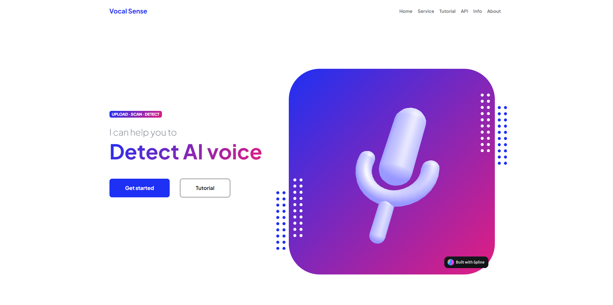

# Vocal Sense - AI-Generated Voice Detection

**Vocal Sense** is a web application designed to detect AI-generated voices in audio files, helping users identify authentic versus synthesized voices. The project was awarded **3rd Place at the National Software Contest 2024: Innovation For Science (NSC Thailand)**, hosted by Thammasat University.

## Project Recognition
- **Award:** 3rd Place - National Software Contest 2024: Innovation For Science (NSC Thailand) [Competition Results](https://www.facebook.com/photo/?fbid=8740391092655821&set=oa.886373373391003&locale=th_TH)
- **Organized by:** National Science and Technology Development Agency (สำนักงานพัฒนาวิทยาศาสตร์และเทคโนโลยีแห่งชาติ) [Facebook Page](https://www.facebook.com/groups/NSCThailand/) [Website](https://www.nstda.or.th/home/)
- **Hosted at:** Thammasat University, 2024
- **Team Members:** 
  - **Tarnakij Pornvoravanij** [Github](https://github.com/ShiroRinS) (Me)
  - **Takdanai Kreangphet** [Github](https://github.com/TakdanaiGH)
- **Advisor:** Assistant Professor Napa Sae-Bae
 [About Team](https://vocalsense.pythonanywhere.com/AboutUs/)
---

## Key Responsibilities
### **My Contributions:**
- **Website Development:** Designed and implemented the website interface and infrastructure using Python, Django, JavaScript, HTML, CSS, and Bootstrap.
- **Model Integration:** Deployed and integrated the AI model, enabling seamless handling of user inputs and displaying classification results for AI-generated voice detection.
- **Full-Stack Management:** Managed the end-to-end functionality, from receiving audio input to providing classification output (excluding model training).
- **Public Deployment:** Deployed the application on the internet for public access.
- **Presentation:** Served as the pitch presenter, effectively communicating the project’s objectives, methodologies, and results. - Here is a sample of our [Presentation Video](https://youtu.be/F6eIf48JZ9I), I am the first speaker.

---

## Project Features
- **AI-Generated Voice Detection:** Accurately analyzes audio files to distinguish AI-generated voices from human ones.
- **Appealing Interface:** A modern, intuitive UI with minimal 3D elements and animations for an enhanced user experience.
- **Real-Time Analysis:** Processes and returns results quickly, ensuring efficient user experience.

---

## Technology Stack
- **Backend:** Python, Django
- **Frontend:** JavaScript, HTML, CSS, Bootstrap
- **Deployment Platform:** PythonAnywhere
- **AI Model:** Rawnet2 (for more details about the model, please visit [this link](https://github.com/TakdanaiGH/AI-Voice-Detector), created by my colleague, Takdanai Kreangphet) 
---

## VocalSense Usage Guide
**No Installation Required:**
VocalSense is a cloud-based web application accessible through any browser on various devices, eliminating the need for additional installation.

**How to Use VocalSense:**
1. Open a web browser on your computer or mobile device with an internet connection.
2. Enter “https://vocalsense.pythonanywhere.com/” in the browser's search bar. [Or click here!](https://vocalsense.pythonanywhere.com/)
3. Click the “**Get started**” button on the left side to begin.

5. The site will direct you to the audio file input page.
6. Click the “**Upload File**” button and select the audio file you want to analyze for AI generation. 
7. The site will analyze the file and display the percentage likelihood of it being AI-generated.

8. To analyze another audio file, click the “S**can next file!**” link in the middle.
---

## Poster

    

---

## Contact
For any questions or feedback, please reach out at [tarnakij.vanij@g.swu.ac.th].

---

**Thank you for exploring Vocal Sense!**
